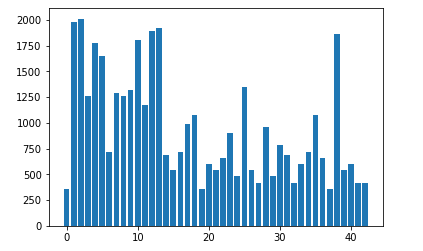

# **Traffic Sign Recognition** 


The goal of this project was to build a neural network that is able to classify the pictures of German traffic signs. The neural network was build using TensorFlow library and it was trained using an example dataset.  

### Dataset Summary and Visualisation..


The given dataset which was used to train the network consisted of three subsets. The training set, the validation set and the test set. The images in all three sets were distributed over 43 different classes representing 43 different german traffic signs. 

The distribution of the data was as follows: 
- The training set contained 34799 images.
- The validation set contained 4410 images
- The testing set contained 12630 images.

Their Distribution over the 43 classes is shown below

- The training set:

- The testing set:

- The Validation set:


The training set was found have some classes which had far more representation than other classes. Some classes had ~2000 examples in the training set while some were found with as little as 180 examples

### Augmenting the training set

The training set was analysed. The classes which were represented by less than 500 examples in the training set were chosen and the images representing these classes were processed a bit and added back to the training set

#### The processing techniques used: 
- Sharpening the image 
    - The image was sharpened and added back to the training set 
- Rotated
    - The image was rotated between and angle of 16 and -16 degrees chosen randomly
- Translated
    - The image was translated between 0 and 5 pixels in both the horizantal and vertical directions

#### The training set after augmenting: 


After augmenting the training set contained 40859 examples

### The images

The model was designed to accept grayscale images of dimensions 32x32. The given dataset had color images of dimensions 32x32 but with three color channels. So preprocessing was done to all the training, test and validation sets. It consisted of following steps

- Turning the image into grayscale
- Normalizing the image so that pixel values lie in the range of [-0.5,0.5]

The preprocessing was applied to all the images in all three sets and the training set was shuffled

### The Neural Network Model
A few neural networks were tried with varying amount of success and finally the architecture with the following layers was used 
- The input image of size 32x32x1
- 3x3 Convolution layer (Input = 32x32x1, Output=30x30x6)
- A Relu Activation layer (Input = 30x30x6, Output=30x30x6)
- 3x3 Convolution layer (Input = 30x30x6, Output=28x28x16)
- A Relu Activation layer (Input = 30x30x6, Output=28x28x16)
- Max Pooling Operation (Input = 28x28x16, Output=14x14x16)
- 5x5 Convolution layer (Input = 14x14x16, Output=10x10x32)
- Max Pooling Operation (Input = 10x10x32, Output=5x5x32)
- The above layer is flattened (Input = 5x5x32, Output=800)
- Fully Connected Layer (Input = 800, Output=240)
- A Relu Activation layer (Input = 240, Output=240) followed by dropout while training
- Fully Connected Layer (Input = 240, Output=120)
- A Relu Activation layer (Input = 120, Output=120) followed by dropout while training
- Finally a Fully Connected Layer with (Input = 120 - 43 logits)


| Layer         		|     Description	        					| 
|:---------------------:|:---------------------------------------------:| 
| Input         		| 32x32x1 Grayscale image   				    | 
| Convolution 3x3     	| 1x1 stride, valid padding, outputs 30x30x6 	|
| RELU					| Activation									|
| Convolution 3x3       | 1x1 stride,  outputs 28x28x16 				|
| RELU          	    | Activation 									|
| Max Pooling 	    	| 2x2 stride,  outputs 14x14x16        			|
| Convolution 5x5		| 1x1 stride,  outputs 10x10x32        			|
| RELU                  | Activation                                    |
| Max Pooling           | 2x2 stride,  outputs 5x5x32                   |
| Fully Connected       | 800 neurons                                   |
| RELU with dropout     | Activation                                    |
| Fully Connected       | 240 neurons                                   |
| RELU with dropout     | Activation                                    |
| Fully Connected       | 120 neurons                                   |
| RELU with dropout     | Activation                                    |
| Fully Connected       | 43 neurons                                    |
| Softmax               | Softmax Probabilities of logits               |

 

#### Training the model

In order to train the model the softmax of the logits was calculated and cross entropy of the softmax probabilities with the one-hot encoded labels was also calculated. The average of these cross entropies was taken as a measure of loss. This loss was minimized using AdamOptimizer with a learn rate of 0.001. The training set was divided into batches of 128 images each and the training was carried for 10 EPOCHS 

### Final Model Results
- Training set Accuracy   : 99.8%
- Validation set Accuracy : 95.2%
- Test set Accuracy       : 94.7%

### Approach taken to design the model
The LeNet model was used as a basis. The LeNet model has proven to be very effective in classifying images of digits. It also takes input as 32x32 grayscale images. The traffic sign data is similar to the mNIST database in the way that each picture of traffic sign also contains only one symbol.

At first the LeNet model was used as it is. This gave a validation set accuracy of ~87%. Next dropout was applied while training the network which resulted in validation set accuracy of ~93%. 

The next step taken was introduction of an extra convolutional layer which greatly improved validation set accuracy to ~96%

Later L2 regularisation was done to weights but that didnt show any improvement in the performance of the network and hence was removed.

The learning rate, batch size and number of epochs were varied and finally these parameters were settled upon

 - BATCHSIZE : 128
 - LEARN RATE: 0.001
 - EPOCHS    : 10

## Tests on new images found on the web


These are five of the images I found on the web. Some of these have writing written across them. The first one is SpeedLimit (20 km/h) sign drawn on the road. The General caution sign has red and white lines in the background which are similar to the lines on traffic signs.

#### Results

| Image			        |     Prediction	        					| 
|:---------------------:|:---------------------------------------------:| 
| SpeedLimit 20km/h     | Speed Limit 70km/h   							| 
| Stop      			| Stop  										|
| General Caution		| General Caution								|
| SpeedLimit 60 km/h	| SpeedLimit 60 km/h					 		|
| Slippery Road			| Slippery Road      							|

The model correctly classifies 4 out of five images making the accuracy of the model 80 % on this set. Below are top 5 softmax probablities calculated by the model for each of these images


- Image Number :  1 
    - Correct Label : Speed limit (20km/h)
    - Speed limit (70km/h)  :  0.846823
    - Keep left  :  0.0916974
    - Speed limit (20km/h)  :  0.0229757
    - Speed limit (30km/h)  :  0.00787669
    - No vehicles  :  0.00646658

Here you can see that the model wrongly classifies the 20 km/h sign as 70km/h. It is 84% sure about its classification while it does give small amount of probabilities to 20km/h and 30 km/h and the keep left sign


- Image Number :  2
    - Correct Label : Stop
    - Stop  :  0.99922
    - Keep right  :  0.00067399
    - Road work  :  4.09619e-05
    - Speed limit (60km/h)  :  1.86285e-05
    - End of all speed and passing limits  :  1.64345e-05
    
Here the model is very sure about the predicted label of "Stop". it gives 99.9 % probability to stop label while probabilities for all other in the top five are ~0-%


- Image Number :  3
    - Correct Label : General caution
    - General caution  :  0.981777
    - Traffic signals  :  0.01669
    - Pedestrians  :  0.000909979
    - Keep left  :  0.000381297
    - Road work  :  7.40108e-05
    
    
Here the model is very sure about the predicted label of "General Caution". It does give a little amount of probablity to the label "Traffic signals" which is similar looking sign


- Image Number :  4
    - Correct Label : Speed limit (60km/h)
    - Speed limit (60km/h)  :  0.969246
    - Speed limit (20km/h)  :  0.0220788
    - Wild animals crossing  :  0.00363419
    - Speed limit (30km/h)  :  0.00193961
    - Dangerous curve to the right  :  0.001909


- Image Number :  5
    - Correct Label : Slippery road
    - Slippery road  :  1.0
    - Dangerous curve to the right  :  1.14637e-08
    - Dangerous curve to the left  :  3.21367e-10
    - Bicycles crossing  :  5.53863e-12
    - Children crossing  :  3.52787e-13


### Visualising the CNN

The image of a stop sign was passed through the neural network and the activations though first two convolutional layers were visualised. It is seen that the neural network has learned on its own to recognise the relevant information in the pictures in order to classify them. In the activation maps its seen that the neural network on its own extracts the relevant information. The signboard as a whole can be seen highlighted in some of the activations. The letters are also highlighted while as the irrelevant information like background dont get activated. The neural network wasnt explicitly told to find lines or letters


```python

```
